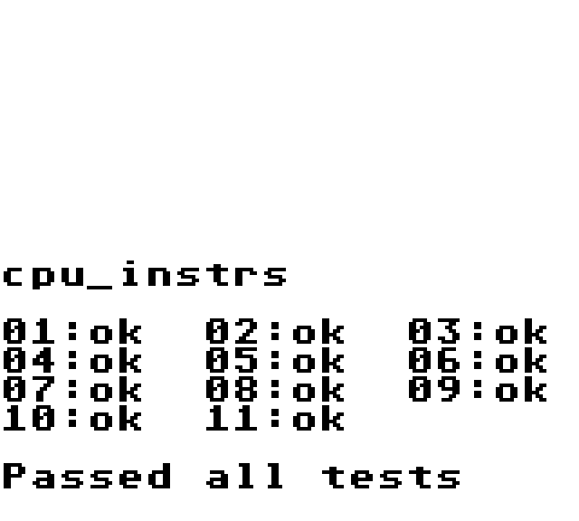

## TypeScript GameBoy Emulator

### Running
```
npm install
npm run serve
```

### Using
Presently interface is extremely basic as emulator is being worked on. Click "Choose File" to select a rom 
in .gb format. Arrow keys are dpad, Enter is Start, a is A, b is B. Nicer UI and controller support to be
added when emulator is farther along.

### Emulator Test Status
There are various test roms for GameBoy emulators to test accuracy. So far fully passing tests are:

#### Blargg CPU Instruction Test


#### DMG Acid 2


